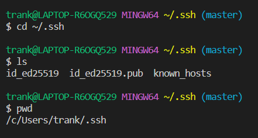

# Lab 2 - Servers and SSH Keys
---
## Part 1: Creating a web server
`ChatServer` Implementation: The code will separate the url into `user` and `message` separated by a `:`. You can change the `user` and message. As you reload the page, the server will update the chat. Note that all previous messages and user will still be on the server (as long as the server is still running).
```
import java.io.IOException;
import java.net.URI;
import java.util.ArrayList;

class Handler implements URLHandler {
    // The one bit of state on the server: a number that will be manipulated by
    // various requests.
    ArrayList<String> strMessage = new ArrayList<String>();
    public String handleRequest(URI url) {
        String user;
        String message;
        if (url.getPath().contains("/add-message")) {
            String[] parameters = url.getQuery().split("&");
            String[] userParameter = parameters[1].split("=");
            String[] messageParameter = parameters[0].split("=");

            user = userParameter[1];
            message = messageParameter[1];

            if (!user.isEmpty() && !message.isEmpty()) {
                String newMessage = user + ": " + message;
                strMessage.add(newMessage);
                return String.join("\n", strMessage);
            }
        }

            
           
        
        return "This is the beginning of your chat!";
    }
}


class ChatServer {
    public static void main(String[] args) throws IOException {
        if(args.length == 0){
            System.out.println("Missing port number! Try any number between 1024 to 49151");
            return;
        }

        int port = Integer.parseInt(args[0]);

        Server.start(port, new Handler());
    }
}
```
> If there is no input, then server will return a nice message (`This is the beginning of your chat!`). As of now, any path that is not in the format: `/add-message?s=<string>&user=<string>` will return the `This is the beginning of your chat!` message. You can also view the chat history as long as the server is still running and you send a message using the path `/add-message?s=<string>&user=<string>`.

- The `String` arrays are used to as parameters to identify where in the url we want `user`and `message` to be. In this case, we are following the format: `/add-message?s=<string>&user=<string>`. We also need to create a `String` such that the message we see on the server follows the format: `user: message`. Note: we also want to add `\n` such that the next message will be printed on a new line.
- If there are more users, then it will be concatenated (ie. `user1+user2`). The same goes for the message too!
---
### Example 1

- Firstly, we need the program to obtain the url of the local server when we run `ChatServer`. This is where `handleRequest` comes into play! The `handleRequest(URI url)` method proceses the request in the parameter. In this case, it is the url of the server and saves it as a variable named `url` which is a `String` type. The `url.getPath().contains("/add-message")` includes `.getPath()` to obtain the url path of the server. Then `.contains()` is called to check if the url path includes the string `/add-message`. If so, then it will return `true`. From there, we will go into the `if-statement` where 3 String arrays are created. The `.getQuery()` method will obtain whatever is after the query (after the `?`). Then we will use `.split(&)` to split the query into 2 elements in the String array between `&`. We use the `isEmpty()` method on both the user and message to check if `user` and `message` is not empty. Then we create a history of the conversation in `ChatServer` with `strMessage.add(newMessage)` where it stores in the format `user : message` in each index of the ArrayList. Finally, `String.join("\n", newMessage)` is a method that is called so that each message is returned on a new line. Why would we put `"\n"` first? It's because after returning `newMessage`, we want the next message to be on a new line. I would think that swtiching the order (`String.join(newMessage, "\n")`) would also work because it would return `newMessage` and then go to a new line.

Before:
```
String user; --> user = null;
String message; --> message = null;

"s=Hello&user=jpolitz"
["s=Hello", "user=jpolitz"]
```
> Initially, `user` and `message` are not assigned so they are by default `null`. We split once more to obtain the message and user with `.split("=")`. Since `parameter` is String[ ], we can index and define what element is the user and the message. In the end, the url and String array gets changed.

After:
```
user = ["user", "jpolitz"]
message = ["s=", "Hello"]

user = userParameter[1]; --> user = "jpolitz"
message = messageParameter[1]; --> message = "Hello"
```
> This is what I think `.split("=")` would work and why we use index at 1 rather than at index 0. We then update `user` and `message` to the second index (zero-based array indexing) in the String array such that `user` will now be `"jpolitz"` and `"message"` will now be `"Hello"`. 

### Example 2

- The same methods from example 1 are called and displayed on `ChatServer`. The `handleRequest(URI url)` method is called where it obtains the local server and sets it to the variable `url`. From there, the `url.getPath()` is called where it obtains the path of the url server and then we use that to check with the `.contains("/add-message")` method to see if `url` has the path "`/add-message`". We then create one main String array named `parameter` which calls the `.getQuery()` method to obtain the path after the `?` and then calls `.split(&)` to split the String to separate using `&` as the location to split the string. The differentce is that there are more words in as `message`. Notice that when we only split the long message from the user, the message returned includes lots of `+` which are space characters `" " `in the string. Another thing to note is the url for this example: there aren't `+` in the url but it shows on when obtaining the path after `/add-message`. My guess is this is a URL encoding--where some would have `+` as space characters or `%20` because a space character is still a character and defines the url!
```
Parameters = ["s=According to all known laws of aviation, there is no way a bee should be able to fly. Its wings are too small to get its fat little body off the ground. The bee, of course, flies anyway because bees don't care what humans think is impossible. Yellow, black. Yellow, black. Yellow, black. Yellow, black. Ooh, black and yellow! Let's shake it up a little. Barry! Breakfast is ready! Ooming! Hang on a second. Hello? - Barry? - Adam? - Oan you believe this is happening? - I can't. I'll pick you up. Looking sharp. Use the stairs. Your father paid good money for those. Sorry. I'm excited. Here's the graduate. We're very proud of you, son. A perfect report card, all B's. Very proud. Ma! I got a thing going here. - You got lint on your fuzz. - Ow! That's me! - Wave to us! We'll be in row 118,000. - Bye! Barry, I told you, stop flying in the house! - Hey, Adam. - Hey, Barry. - Is that fuzz gel? - A little. Special day, graduation. Never thought I'd make it. Three days grade school, three days high school. Those were awkward. Three days college. I'm glad I took a day and hitchhiked around the hive. You did come back different. - Hi, Barry. - Artie, growing a mustache? Looks good. - Hear about Frankie? - Yeah. - You going to the funeral? - No, I'm not going." , "user=kevin" ] 
```
> Yes, it's the introduction to Bee Movie (2007)...anyways, we sucessfully separated the path into 2 elements in the array: one **large** message at index 0 (Parameters[0]) and a user at index 1 (Parameters[1]).
- `.split("=")` is called to split the string of index 1 (the user) and assign it to userParameter. We call `.split("=")` once more *but* on the large string message (Parameter[1]) wherever it sees a `=` and assign it to messageParameter.
- Then we concatenate the user and message, following the format: `user : message` with a new line `\n`.
---
## Part 2: SSH Keys

> Note: The location of the key after the `ssh-keygen` command in the terminal will let you know where your public key is stored. If you have already used `ssh-keygen` before but don't remember where your keys are stored, I believe that they are located in a similar absolute path for all (not sure for MacOS). I also don't have written down my private key but I think it's the one without the `.pub`(`.pub` means "Publisher" document file, similar to PDfs--I think)

- The absolute path for my private key is: `/c/Users/trank/.ssh/id_ed25519`
- The absolute path for my public key is: `/c/Users/trank/.ssh/id_ed25519.pub`


> You will know that you have sucessfully inputted your key when you do not need to input your password! Keep in mind that the server recognizes my device (my laptop: `trank@LAPTOP-R60GQ529`). If I wanted to `ssh` into the `ieng6` server on a different device, I would have to verify again because the server does not recognize a new device

---
## Part 3: I Learned Something New!
I did not know that we could generate our public and private key such that we can login into the `ieng6` servers without inputting our password everytime. I learned how to run a server--with the help of `NumberServer.java` and `Server.java`. I also learned how to read a url and that the bunch of random characters, numbers, and symbols sent information to the webpage. Finally, I learned that `bash` and `powershell` are two unique terminals.
