# Lab 4 - Vim
---
Steps 4 through 9 demonstrates a scenario where we will clone one of our repositories, edit the code, save the changes, run the fixed code, commit/push the changes to our Github repository. We can check to see if the change was sucessful at the end. Here are the steps: 

## Step 4: Log into ieng6
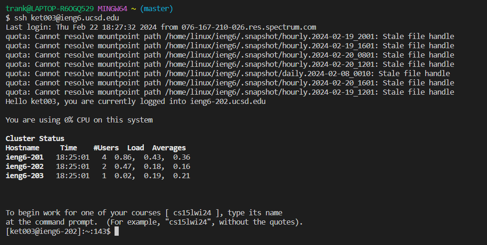
`ssh ket003@ieng6.ucsd.edu <enter>`
We use `ssh` to remotly connect to a computer (in this case, we are attempting to connect to a computer on the `ieng6` machine), then we hit `<enter>`. A lot of stuff will happen and at this point in the quarter, we should not be prompted to input our password to `ssh`.

## Step 5: Clone your fork of the repository from you Github account (using the SSH URL)
Obtain the Github SSH link
`git clone git@github.com:7seraph/lab7.git <enter>`
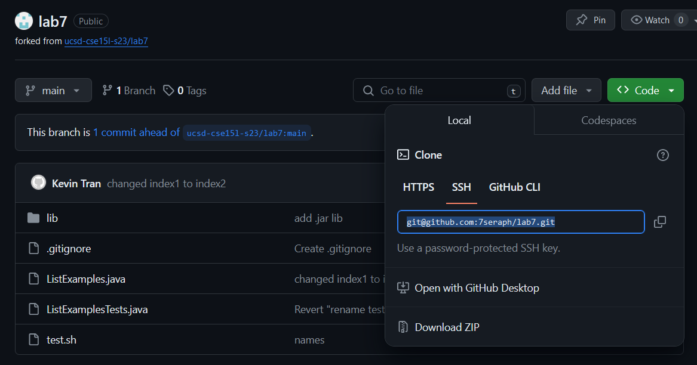
We are using `git` to: 
1. Clone the forked repository of lab 7 (https://github.com/7seraph/lab7) using the **SSH Link Option**! Note: the SSH Link option is located at the green `Code` button -> click on `SSH` and you will get the link.
2. Copy the link and use `git clone` followed by the `ssh link`. Hit `<enter>`. 

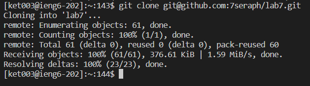
We will know that it is a successful clone when we don't get an error message. 

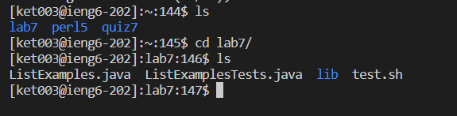
`cd la <tab> <enter> ls`
Now we want to be in the `lab7` directory so we will use the `cd` command. For efficiency, I type `cd la` followed by `<tab>` for completion. I don't have to manually type `cd lab7`. Then I chech the contents inside the `lab7` directory with `ls`. That way, I can see what files and directories are inside (just for my sanity).

## Step 6: Run the tests
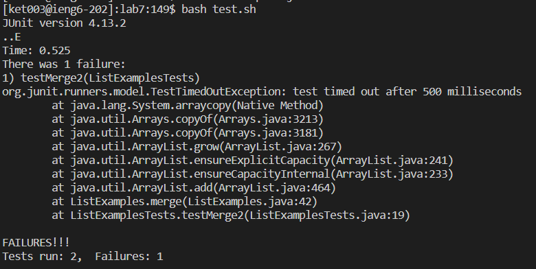
`bash test.sh <enter>`
We run the shell script named `test.sh` by calling `bash` followed by the script and hit `<enter>`. The script contains the library of JUnit, compilation of java files, and runnning the specifically `ListExamples` java file. `bash` runs script files! 

## Step 7: Edit the code file to fix the failing test
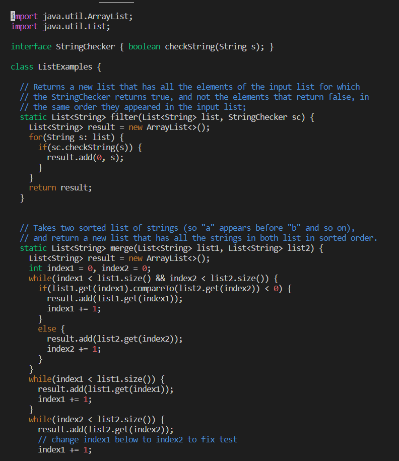
`vim ListE <tab> .java <enter>`
To edit the code file and fix the failing test, we used `vim`. I type `vim ListE` followed by `<tab>` to complete the file named `ListExamples`. Since there are two files that contain `ListExamples`, I have to specify which one! 
1. ListExamples.java
2. ListExamplesTests
Then I type `.java` because we want to edit `ListExamples.java` and hit `<enter>` to use `vim` on `ListExamples.java`.

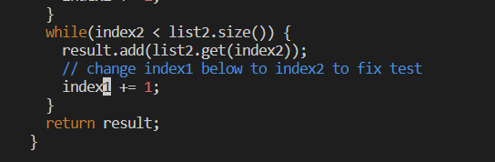
Begin keystrokes `:$ <enter> j j j j j j l l l l x i 2 <esc> :wq! <enter>`
While I am in "normal mode" (this is where I can move the curor around **BUT** not edit the file), I type `:$` followed by `<enter>` and that makes the cursor go to the last line which is `}`. I then press `j` 6 times to move the cursor up 6 lines. In order to move to the right, I press `l` 4 times to move the cursor 4 to the right such that the cursor is on `1` of `index1`.
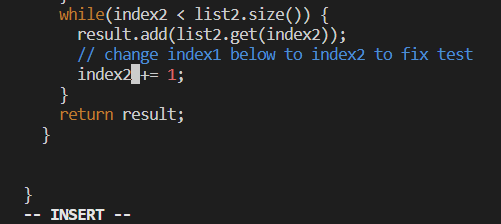
Next, I press `x` to remove the `1` and then press `i` to go to "insert mode". Once in insert mode, any keys that I press will be before the cursor--I could also use `a` instead of `i` but `a` will insert after the cursor; so I would have the cursor over `x` in `index`. This is where I type `2` so now it is `index2`. To exit out of insert mode, I press `<esc>`. Finally, I press `:wq!` followed by `<enter>` to save (`w`) and quit (`q`) vim. The `!` is to override or force the operation. 
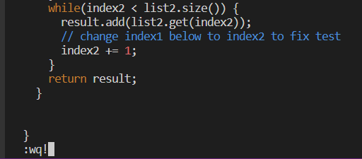
Once I press enter after `:wq!`, vim will exit and I am back to my terminal. 
## Step 8: Run the test, demonstrating that they now succeed
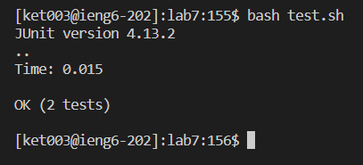
`bash test.sh <enter>`
I call `bash` to run the script named `test.sh` and press `<enter>`. We will know that we have successfully fixed the error when we get the `OK` message from JUnit.

## Step 9: Commit and push the resulting change to your Github account
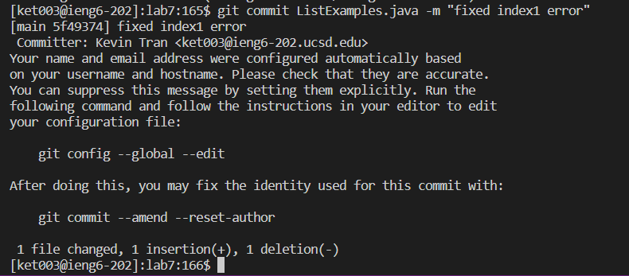
`git commit ListEx <tab> .java -m "fixed index1 error" <enter>`
I use `git commit` to make a "checkpoint" of the changes made in `ListExamples.java`. I used `<tab>` to complete the file name and typed `.java` because I want the checkpoint and changes that we made present for `ListExamples.java`. This is all followed by `-m` which is used with `git commit` to provide a short description or "message" of the checkpoint. Usually, it's best to provide a general idea of what that change is about. Hence, I add my own custom message in quotes (" ") and then press `<enter>`.

`git push <enter>`
I call `git push` of the changes that I made on `ListExamples.java` to be uploaded on from the local repository to the remote repository. This is useful for version control and ensuring that any collaborators will the most updated version of the files. 
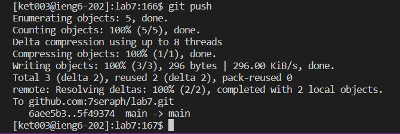
We can also see on Github webpage that we were successful in pushing the changing onto the forked repository.
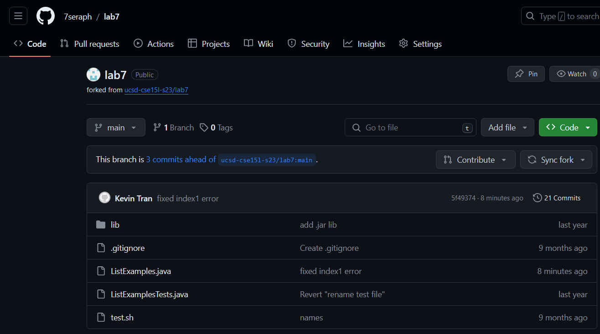
