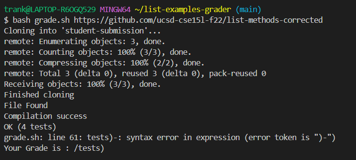

# Lab 5 - Putting it All Together
---
Suppose that our directory is structure as such. Upon working on an assignment during lab section, a student encountered an issue. The student is confused why this issue/bug occurs and decides to post it on EdStem.
```
Example directory structure, file contents in parentheses

  list-example-grader/
    grading-area/
      lib/
        hamcrest-core-1.3.jar
        junit-4.13.2.jar
    |-  IsA.class
    |-  ListExamples.class
    |-  ListExamples.java
    |-  StringChecker.class
    |-  test-results.txt
    |-  TestListExamples.class
    |-  TestListExamples.java
  lib/
    hamcrest-core-1.3.jar
    junit-4.13.2.jar
  student-submission/
    |-  ListExamples.java
  |-  code
  |-  git-output.txt
  |-  grade.sh
  |-  GradeServer.java
  |-  Server.java
  |-  TestListExamples.java

```
## Post on EdStem
### Shell Syntax Error?
**Student post**: "For the Lab of week 6, I am working on the grader script. I used `git clone https://github.com/ucsd-cse15l-s23/list-examples-grader` to get the files to begin the lab assignment. When I am testing if my grader script `grade.sh` works correctly, I am using `bash` and when I run the script, I use `bash grade.sh https://github.com/ucsd-cse15l-f22/list-methods-corrected`. However, I get an error at line 64 which is calculating the score with `grade.sh` however, it's saying that ")-" is a syntax error. I thought that it could be the spaces and so I removed the space and tried `bash grade.sh` but it still failed. Grade is also printing `/tests` when it should be a numerical value."



**TA Response**:
Hmm, there is a lot of variables assigned to different expressions. What are the values of each variable? Do they match appropriately? In other words, is there a way to check if each variable is assigned properly? How could we check? 
> The student recognizes that the symptom occurs at line 61 in their shell script. The student also mentioned that they attempted to fix the error but the issue is still there. Since there are a lot of variable declaration, the student should make sure that the variables are assigned correctly. Therefore the issue could be the line itself and if the student attempts to fix the issue but error persists, then we can check if the lines before line 61 has an issue.

**Student Response (Updated)**: I run my grade script again with `bash grade.sh https://github.com/ucsd-cse15l-f22/list-methods-corrected`. After the script runs, I've used pipe `|` into a new text file named `test-results.txt` and the contents inside it are:
```
JUnit version 4.13.2
....
Time: 0.014

OK (4 tests)
```
This means that the compilation and running JUnit should be okay since there were no errors with that. The `test-results.txt` shows the number of tests and it should be 4.

Next, I've printed out `$TOTALTESTS` and `$FAILED` with `echo`. Both are incorrectly assigned! They should be assigned a numerical value. I see that the issue now is not the syntax but how I obtained the string. When I wanted to get `4` from `OK (4 Tests)`, I wanted the value 4. What I expected was to take the numerical value after the word `tests`. However, what I actually got was `tests)`. This meant that `awk` must have split the line of input incorrectly. My guess was that `TOTALTESTS=$(echo $TESTRESULTS | awk -F'[, ]' '{print $3}')` actually separated like `OK, (4, tests)` which was why when I do `{print $3}`, I would get `tests)`. 


## This was the grade script before fixing the bug:
```
CPATH='.:lib/hamcrest-core-1.3.jar:lib/junit-4.13.2.jar'

rm -rf student-submission
rm -rf grading-area

mkdir grading-area


git clone $1 student-submission > git-output.txt
echo 'Finished cloning'


# Draw a picture/take notes on the directory structure that's set up after
# getting to this point

# Then, add here code to compile and run, and do any post-processing of the
# tests

# check if file exists
if [ -f "student-submission/ListExamples.java" ]
then 
    echo "File Found"
else 
    echo "File not found"
    exit 1
fi

#copy over the files to directory

cp -r lib grading-area/
cp student-submission/ListExamples.java grading-area/
cp TestListExamples.java grading-area/


# compile
cd grading-area
javac -cp $CPATH *.java

# checks if error occured while compiling
if [ $? -ne 0 ]
then
    echo "Compilation failed"
    exit 1
else
    echo "Compilation success"
fi

#run the file
java -cp $CPATH  org.junit.runner.JUnitCore TestListExamples > test-results.txt

#gets results of JUnit Test
TESTRESULTS=$(cat test-results.txt | tail -n 2 | head -n 1)
echo $TESTRESULTS


TOTALTESTS=$(echo $TESTRESULTS | awk -F'[, ]' '{print $3}')

FAILED=$(echo $TESTRESULTS | awk -F'[, ]' '{print $6}')


PASSED=$(($TOTALTESTS - $FAILED))
GRADE=($PASSED/$TOTALTESTS)
#PASSED=$(($FAILED-$TOTALTESTS)) / $TOTALTESTS
echo 'Your Grade is :' $GRADE
```
Recall that the symptom was thought to be the syntax error (when in reality it was variable `TOTALTESTS` and `FAILED` because both obtained the incorrect values from the JUnit tests). The bug was splitting the output of the JUnit tests and assigning it to the correct variables.

## This was the file after fixing the bug:
```
CPATH='.;lib/hamcrest-core-1.3.jar;lib/junit-4.13.2.jar'

rm -rf student-submission
rm -rf grading-area

mkdir grading-area


git clone $1 student-submission > git-output.txt
echo 'Finished cloning.'


# Draw a picture/take notes on the directory structure that's set up after
# getting to this point

# Then, add here code to compile and run, and do any post-processing of the
# tests

# check if file exists
if [ -f "student-submission/ListExamples.java" ]
then 
    echo "File Found"
else 
    echo "File not found! Please check to see if the file exists."
    exit 1
fi

#copy over the files to directory

cp -r lib grading-area/
cp student-submission/ListExamples.java grading-area/
cp TestListExamples.java grading-area/


# compile
cd grading-area
javac -cp $CPATH *.java

# checks if error occured while compiling
if [ $? -ne 0 ]
then
    echo "Compilation failed!"
    exit 1
else
    echo "Compilation success"
fi

#run the file
java -cp $CPATH  org.junit.runner.JUnitCore TestListExamples > test-results.txt

#gets results of JUnit Test
TESTRESULTS=$(cat test-results.txt | tail -n 2 | head -n 1)
echo $TESTRESULTS


#obtains the number of total tests and failed tests
TOTALTESTS=$(echo "$TESTRESULTS" | awk -F'[[:space:]()]' '{print $3}')
FAILED=$(grep -o 'E' test-results.txt | wc -l)

#calculates and echos the score
PASSED=$(($TOTALTESTS-$FAILED))
GRADE=($PASSED/$TOTALTESTS)

echo 'Your Grade is :' $GRADE
```


By updating `TOTALTESTS` to separate the output from JUnit to specifically the number of tests that ran (the numerical value) and `FAILED` to count for the number of times 'E' occurs from the `test-results.txt` file. The reason for this is to account when running a student submission and a test fails. 'E' in JUnit means that there is an error (or when a test fails). The `wc` command counts for the number of 'E' in the `test-results.txt` file and updates the `FAILED` variable accordingly. Normally, we could just leave the `FAILED` line of code as is but the issue is that the code does not assign itself to a value--`FAILED` is "blank" because let's say for example that all of the tests pass on a student submission...the expectation is that `FAILED = 0` beacuse all tests passsed. However, `FAILED` prints the 6th argument..which there's nothing at the 6th argument. Therefore, `FAILED` equals to nothing and could be an issue when doing arithmetic; hence why the issue appeared in the first place because bash assumes we want `$TOTALTESTS-` and it bash does not know what to do with that but report a syntax error. 

## Reflection
On the second half of this quarter, I've learned that you can do a lot with just using the terminal such as using `vim` to edit/modify or even create files, use `jdb` to debug code and go line by line rather than simply getting an error output that may not be as detailed or sufficient, and running scripts such that we don't have to constantly type/copy and paste the JUnit "implementation"
```
javac -cp ".;lib/hamcrest-core-1.3.jar;lib/junit-4.13.2.jar" *.java
java -cp ".;lib/junit-4.13.2.jar;lib/hamcrest-core-1.3.jar" org.junit.runner.JUnitCore TestListExamples
```
I also learned how to open the code from the terminal onto VSCode with `code <filename>`. Just be sure to be in the correct directory if you just want to use that command. I haven't tried it yet but I think that the command will still work if you are not the correct directory, you may have to include the directory where the file is located. 
